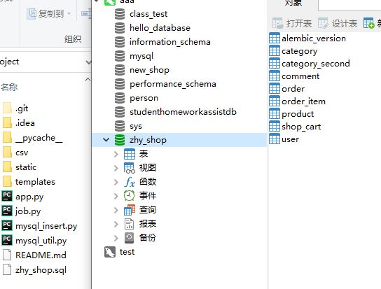
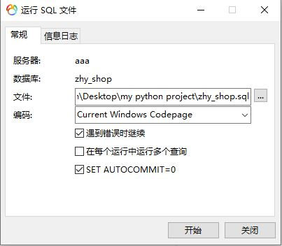
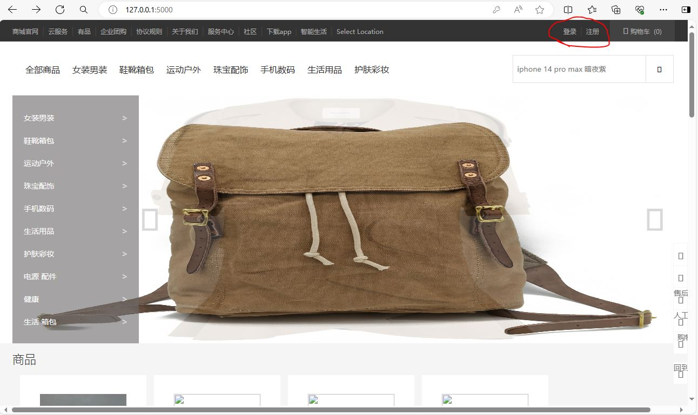
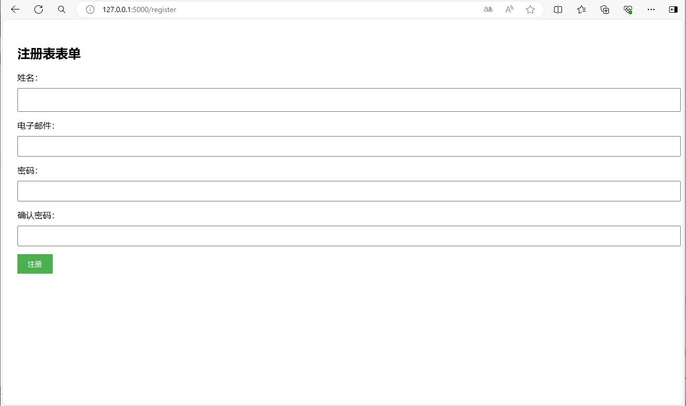
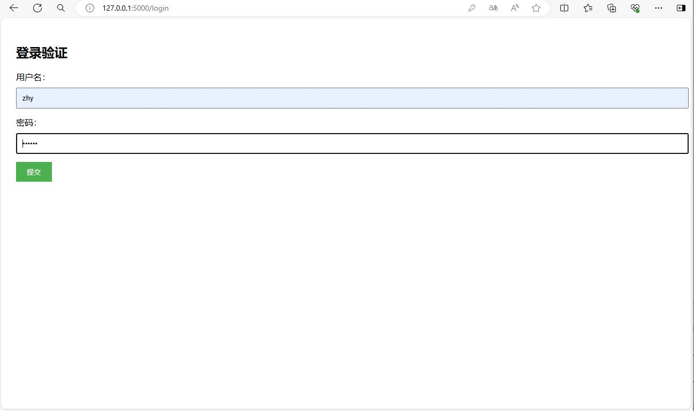
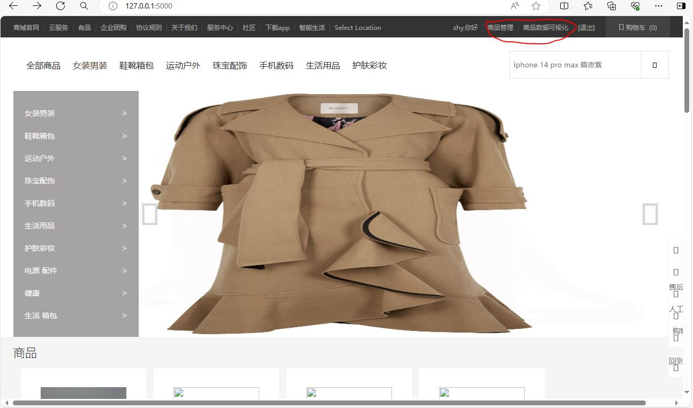
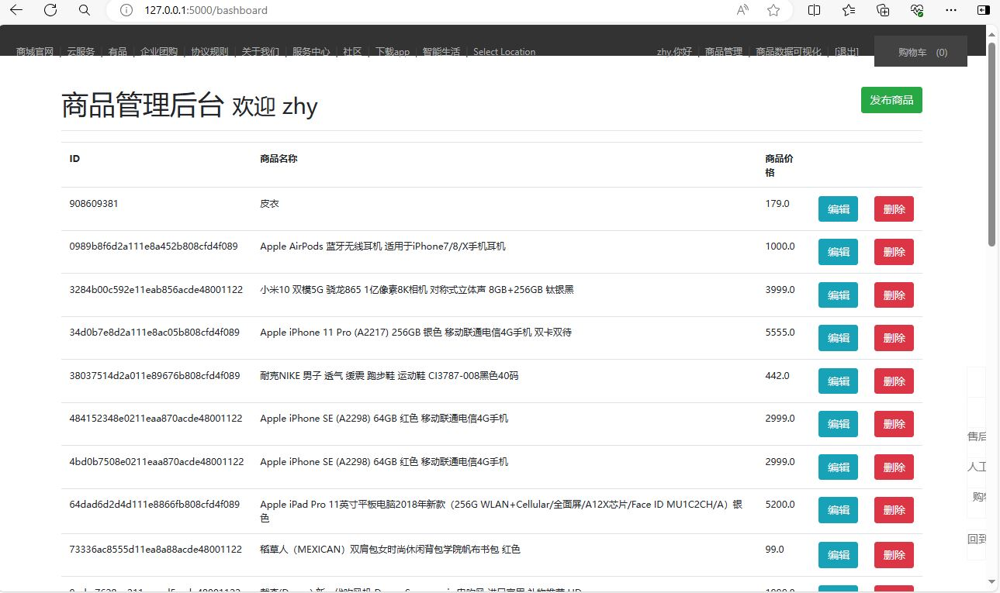
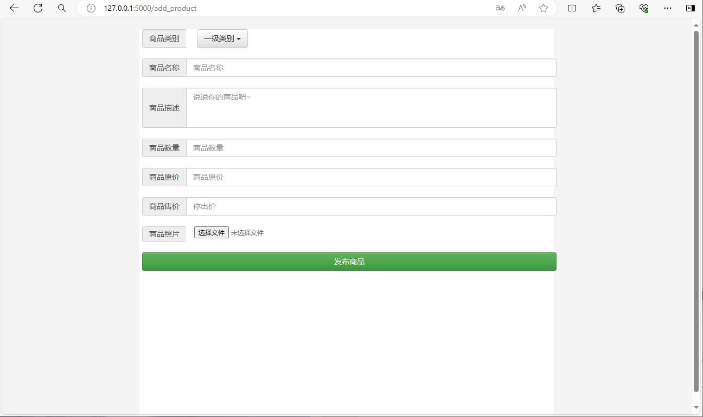
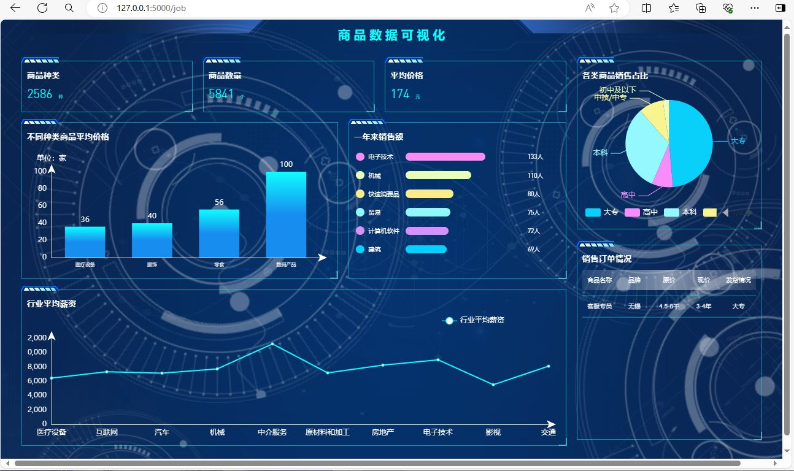

介绍
 
使用flask开的一个商场网站，具有注册登录，数据库管理，商品管理包括添加商品，删除商品，查询商品，商品可视化管理。
该项目在基础上开发，其中参考前端部分。
https://gitee.com/zou-haoyang/my_python_project
 
数据可视化参考：
https://gitee.com/mhtccc/51job_visualization
 
软件架构工具：Pycharm, XAMPP Control Panel, navicat
 
需要的软件：Flask, Flask-SQLAlchemy
 
使用命令行导出
 
pip freeze > requirements.txt
 
安装使用
 
pip install –r requirements.txt
 
安装教程
 
**1.导出数据库sql文件(非必要)**
 
**2.新建数据库zhy_shop**
   

   
**3.导入sql文件**
  
  
 
运行目录下的app.py文件
 
使用说明
 
**1.	登录注册**
 
  
 
注册用户
 
  
 
登录功能
 

 
2.	商品管理，以及商品来自数据库管理
 

 
3.	商品可视化管理
 

 
参与贡献
 
广东科学技术职业学院 计算机学院 人工智能应用技术专业 邹浩洋

